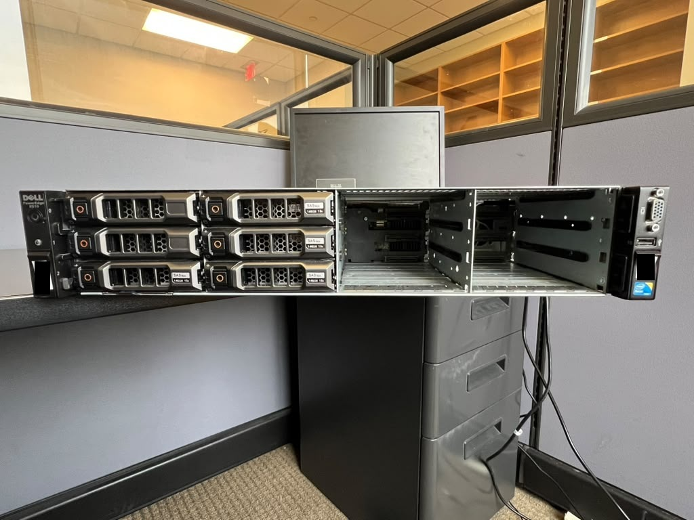
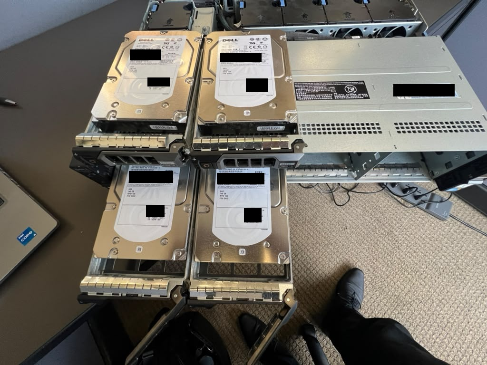
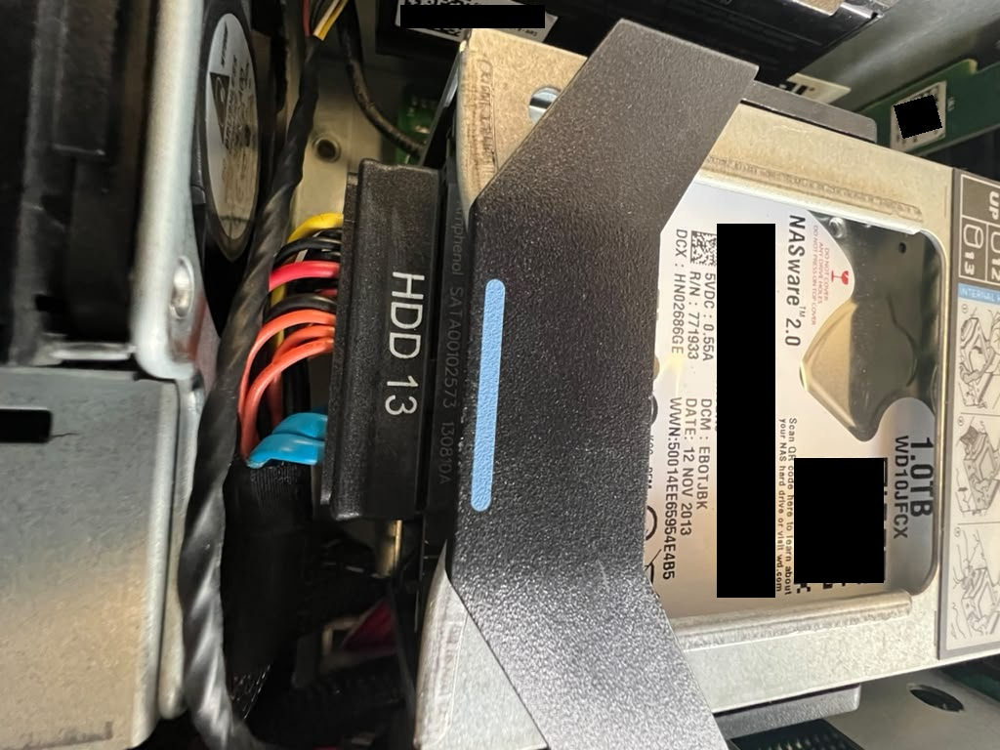
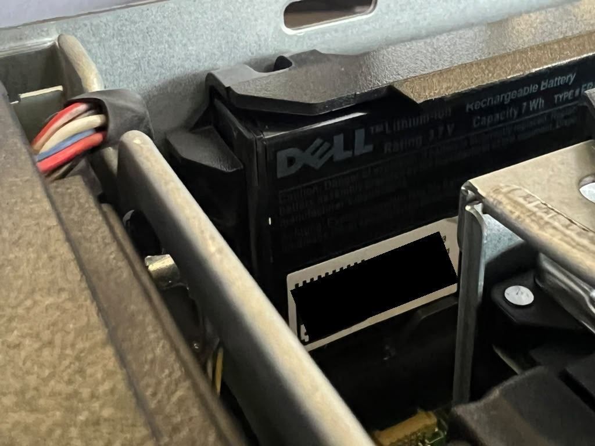
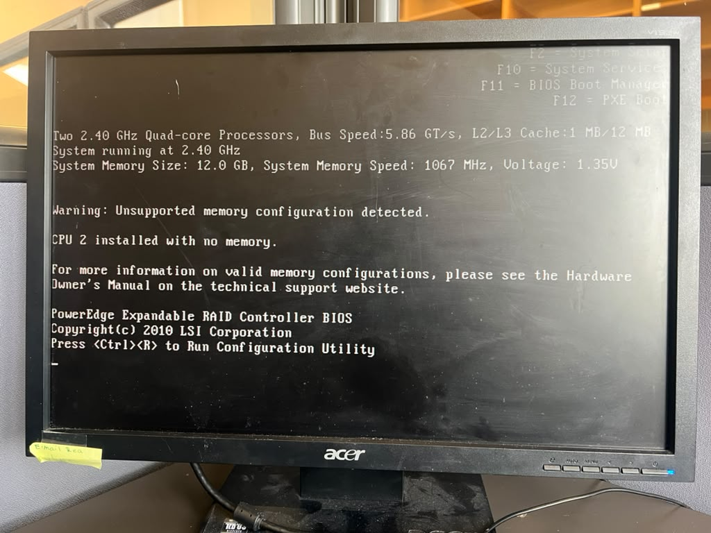
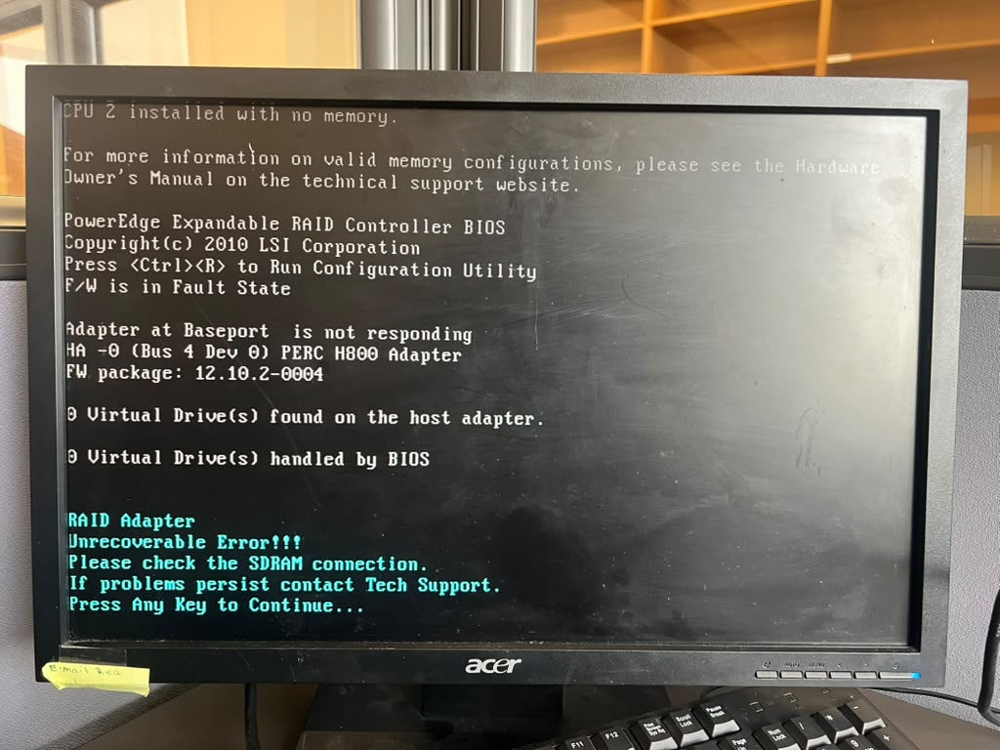

# Dell PowerEdge R510 Hands-On Inspection

This repository documents the physical inspection and startup assessment I performed on a legacy Dell PowerEdge R510 server. I opened the chassis, handled removable components, recorded part labels and connections, powered the server, and captured the BIOS and POST messages that appeared.

The goal was not to claim that the server was repaired. My goal was to establish what hardware is present, document its condition, identify the faults visible during startup, and define the next diagnostic steps.

> **Repository note:** The evidence photos came from the actual inspection. Some original photographs contain equipment identifiers. Keep this repository private until every image has been reviewed for public release.



## What I did

1. I photographed the chassis before opening it.
2. I removed the top cover and inspected the internal layout.
3. I removed the front drive carriers far enough to read the actual drive labels. I did not rely on the labels printed on the carrier handles.
4. I identified the two fixed internal drives, the RAID hardware, cache battery, memory, processors, fans, power supplies, and rear connections.
5. I powered the server and recorded the POST and BIOS screens.
6. I compared the startup messages with the physical condition I observed inside the chassis.
7. I separated confirmed findings from possible causes that still require testing.

## System identified

| Area | Finding | Evidence basis |
|---|---|---|
| Platform | Dell PowerEdge R510, 2U rack server | Chassis and BIOS |
| BIOS | Version 1.12.0 | Startup screen |
| Processors | 2 x Intel Xeon E5620 at 2.40 GHz | POST and BIOS |
| Memory | 12 GB ECC DDR3 at 1067 MHz | POST, BIOS, and physical DIMM inspection |
| Front storage | 4 x Dell-labeled Seagate 146 GB 15K SAS drives | Labels on the removed drives |
| Empty front bays | 2 visible carriers had no drives installed | Physical inspection |
| Internal storage | 2 x WD Red WD10JFCX 1 TB SATA drives | Physical labels |
| Internal RAID | Dell PERC H700 Integrated, DP/N 0R374M | Controller label and physical inspection |
| External RAID | PERC H800, firmware package 12.10.2-0004 | POST |
| RAID battery | Dell lithium-ion battery, type FR463, 3.7 V, 7 Wh | Physical label |
| Network | Integrated Broadcom 5716 dual-port Gigabit Ethernet | BIOS and rear I/O inspection |
| Power | 2 x Dell/Delta 750 W hot-swap power supplies | Physical labels |

The total label-reported raw disk capacity is **2.584 TB decimal**. This number does not represent usable RAID capacity. I did not verify any virtual disk, RAID level, filesystem, operating system, or data condition.

## Inside the chassis


After removing the cover, I mapped the main assemblies and followed the visible cable paths. The server contains two processor sockets, separate memory banks for each processor, a fan wall, redundant power supplies, an internal RAID controller, an external RAID adapter, and two fixed internal SATA drives.

The chassis had moderate dust and normal external wear for its age. I did not see obvious burn damage or visibly swollen motherboard capacitors during the limited inspection.

## Storage inspection

### Front drives



I removed the populated front carriers and read the drive labels directly. Four installed drives are Dell-labeled Seagate Cheetah 15K.7 units marked **SAS, 146 GB, 15K RPM**. The visible model string is `ST3300657SS-H`, and the labels show firmware `EH02`.

Two visible front carriers were empty. The printed carrier labels were ignored because a carrier label does not prove which disk is installed.

### Internal drives



I found two WD Red `WD10JFCX` 1 TB SATA drives mounted one above the other and secured inside the chassis. Together they provide 2 TB of raw internal capacity. Their RAID membership and health were not verified.

## RAID hardware and the main diagnostic lead


The internal controller is a Dell PERC H700 Integrated. POST also identifies a PERC H800 external RAID adapter.

During the physical inspection, I noticed that the cache or memory module on the RAID assembly closest to the power-supply area appeared mechanically stressed and visibly arched. I did not remove or reseat it during this inspection. Because I could not prove from the available evidence which controller generated the physical deformation, I recorded this as a diagnostic lead rather than a confirmed root cause.



I also identified the black lithium-ion RAID battery mounted beside the internal drives. Its label shows Dell type `FR463`, DP/N `0NU209`, 3.7 V, and 7 Wh. I did not test its charge capacity or health.

## POST and BIOS evidence

### Memory warning



POST detected both processors and 12 GB of memory, but displayed:

```text
Warning: Unsupported memory configuration detected.
CPU 2 installed with no memory.
```

The physical layout supports this message: three 4 GB Samsung registered DIMMs were installed in the CPU1 bank, while the CPU2 memory bank was empty. The server can detect the memory, but the topology does not follow the expected balanced configuration for two installed processors.

### RAID error



POST reported the following for the PERC H800:

```text
F/W is in Fault State
Adapter at Baseport is not responding
RAID Adapter Unrecoverable Error
Please check the SDRAM connection
```

POST also reported zero virtual drives on that adapter. This evidence confirms a controller-level startup fault. It does not, by itself, prove that the visibly arched module caused the fault.

## My fault assessment

| Priority | Finding | Why it matters | Confidence |
|---|---|---|---|
| High | PERC H800 enters a firmware fault state and reports an SDRAM connection error | The adapter cannot initialize normally and may block access to attached storage | Confirmed by POST |
| High | RAID cache or memory module appears arched or mechanically stressed | A poor connector contact or damaged module could be related to the SDRAM error | Physical observation, cause unconfirmed |
| Medium | CPU2 has no local memory | POST flags the configuration as unsupported and performance may suffer | Confirmed by POST and physical layout |
| Medium | No bootable device was detected | The server cannot start an operating system in its current verified state | Confirmed by POST |
| Medium | RAID battery condition is unknown | An aged or failed battery can disable write-back cache or generate controller warnings | Component confirmed, health untested |
| Unknown | Drive health and RAID membership | Labels identify the disks but do not establish SMART health, array state, or data integrity | Not tested |

The strongest current hypothesis is a problem in the H800 cache/SDRAM path, connector seating, or the adapter itself. The observed physical deformation makes that area worth checking first, but replacement should not begin until the controller, module, and connectors are safely inspected and tested.

## Recommended next diagnostic session

1. Disconnect power, follow ESD precautions, and photograph the controller and connectors before moving them.
2. Identify exactly which physical adapter corresponds to the H800 POST fault.
3. Inspect the cache module, socket, retaining clips, and battery cable for damage.
4. Reseat the cache module and controller only if the hardware shows no unsafe damage.
5. Boot again and record whether the SDRAM and firmware errors change.
6. Enter the PERC configuration utilities and export or photograph the physical-disk and virtual-disk state.
7. Balance memory across both processors using a configuration supported by the R510 manual.
8. Run Dell diagnostics and review the hardware event log.
9. Test the drives without initializing, clearing, or creating arrays until the value of any existing data is known.

## What this project demonstrates

- Safe physical access to rack-server hardware
- Component identification from labels, board markings, firmware screens, and connection paths
- Evidence-based separation of confirmed faults from hypotheses
- Storage and RAID awareness, including the risk of destructive configuration changes
- Clear technical documentation for a manager and for a future repair session

## Responsible use of AI

I performed the physical inspection and captured the evidence. I used AI to help organize my notes, cross-check terminology, separate observations from assumptions, and turn the evidence into a readable project structure. AI did not touch the hardware, create the observations, or prove the fault cause.

## Repository guide

| Path | Contents |
|---|---|
| [`evidence/`](evidence/) | Selected photographs from the inspection |
| [`notes/component-inventory.md`](notes/component-inventory.md) | Detailed component inventory |
| [`notes/evidence-log.md`](notes/evidence-log.md) | What each photograph proves and what it does not prove |
| [`notes/fault-analysis.md`](notes/fault-analysis.md) | Reasoning behind the fault assessment |
| [`notes/next-session-checklist.md`](notes/next-session-checklist.md) | Practical checklist for the next hands-on session |
| [`docs/Dell_PowerEdge_R510_Manager_Briefing.pptx`](docs/Dell_PowerEdge_R510_Manager_Briefing.pptx) | Short manager presentation |
| [`docs/Dell_PowerEdge_R510_Hands_On_Inspection_Report.pdf`](docs/Dell_PowerEdge_R510_Hands_On_Inspection_Report.pdf) | Formal inspection report |
| [`docs/Dell_PowerEdge_R510_Hands_On_Inspection_Report.docx`](docs/Dell_PowerEdge_R510_Hands_On_Inspection_Report.docx) | Editable report source |

## Scope limits

This was a visual and startup inspection. I did not verify drive health, RAID configuration, usable capacity, operating system status, data contents, battery health, network connectivity, or long-duration stability. The initial no-video condition cleared later, but I did not capture a confirmed corrective action, so I have not assigned a root cause.
