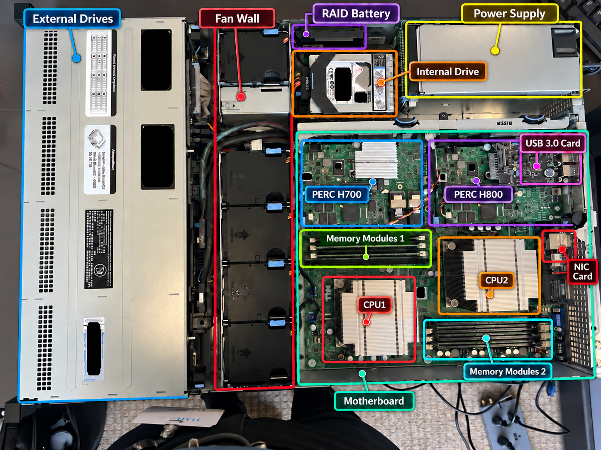
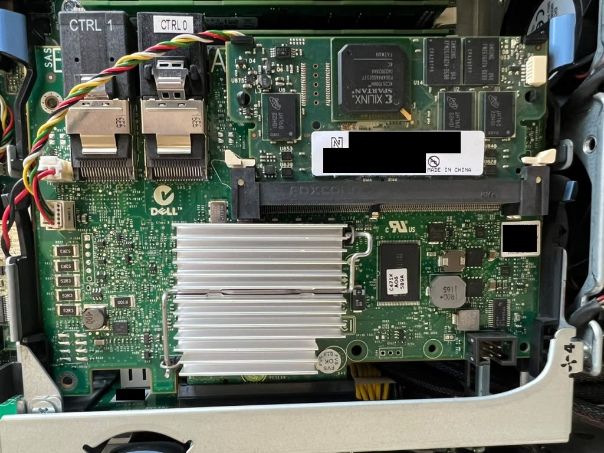

# Dell PowerEdge R510 Legacy Server Hardware Inspection & Component Documentation


> **Repository note:** The evidence photos came from the actual inspection. Any visible equipment identifiers were covered or obscured before publication. All images were reviewed before being included in this public repository.

---

## Project Overview

This repository documents a hands-on physical inspection of a legacy Dell PowerEdge R510 enterprise server.

The primary objective was to identify, inspect, and document the major hardware components that make up the system.

The inspection included:

- Opening the server chassis
- Identifying major internal and external components
- Temporarily removing selected components to inspect physical labels and specifications
- Documenting processors, memory, storage, RAID hardware, power, cooling, and network interfaces
- Inspecting visible cables and hardware connections
- Identifying loose, abnormal, or mechanically stressed components
- Capturing POST and BIOS information
- Documenting startup warnings and hardware faults

All components removed specifically for documentation were returned to their original positions after inspection.

A secondary objective was to perform a visual fault assessment based on physical observations and startup messages.

The server initially powered on but produced no video output. Limited troubleshooting was performed only to restore enough functionality to access and document POST and BIOS information.

The objective was **not** to fully repair or return the server to production service.


---

## Objectives

- Perform a physical inspection of a legacy Dell PowerEdge R510 server.
- Identify and document major server components.
- Record model numbers, part numbers, capacity, interface type, firmware, and other visible specifications where available.
- Temporarily remove selected removable components when required for documentation.
- Reinstall documented components in their original positions.
- Document the internal hardware layout.
- Inspect visible cable and hardware connections.
- Capture POST and BIOS information.
- Identify visible signs of damage, mechanical stress, loose connections, or abnormal component positioning.
- Record startup warnings and hardware faults.
- Distinguish confirmed observations from unverified diagnostic hypotheses.
- Create visual technical documentation of the server for portfolio and future reference.

---

## Inspection Workflow

1. Connected the server to power and attempted the initial startup.
2. Confirmed that the system powered on but produced no video output.
3. Disconnected power and opened the chassis for physical inspection.
4. Inspected the motherboard, processors, memory banks, storage devices, RAID hardware, cooling system, power supplies, expansion cards, and visible connections.
5. Confirmed that neither CPU1 nor CPU2 had memory installed.
6. Installed three compatible memory modules in the CPU1 memory bank to enable startup testing.
7. Inspected the RAID hardware.
8. Found a loose memory/cache module on the PERC H700 assembly located near the two internal 1 TB drives.
9. Carefully reseated the loose H700 memory/cache module.
10. Inspected the second RAID adapter and observed a memory/cache module that appeared visibly arched or mechanically stressed.
11. Intentionally left the mechanically stressed module untouched.
12. Temporarily removed selected components when necessary to document labels and specifications.
13. Reinstalled all components removed for documentation in their original positions.
14. Reconnected the server to power.
15. Confirmed that video output was restored.
16. Captured POST and BIOS information.
17. Attempted to identify a valid boot device for the operating system.
18. Documented hardware inventory, startup warnings, visual abnormalities, and confirmed faults.

---

## System Inventory



| Area | Finding | Evidence Basis |
|---|---|---|
| Platform | Dell PowerEdge R510, 2U rack server | Chassis and BIOS |
| BIOS | Version 1.12.0 | Startup screen |
| Processors | 2 x Intel Xeon E5620 at 2.40 GHz | POST and BIOS |
| Memory | 3 x 4 GB ECC DDR3 modules, 12 GB total at 1067 MHz | Physical inspection, POST, and BIOS |
| Front Storage | 4 x Dell-labeled Seagate 146 GB 15K SAS hot-swap drives | Physical drive labels and front bays |
| Empty Front Bays | 2 visible carriers contained no drives | Physical inspection |
| Internal Storage | 2 x Western Digital Red WD10JFCX 1 TB SATA drives | Physical labels |
| RAID Controller 1 | Dell PERC H700 Integrated, Memory 512MB | Physical controller label |
| RAID Controller 2 | Dell PERC H800, firmware package `12.10.2-0004`, Memory 512MB | POST, Physical inspection |
| RAID Battery | Dell lithium-ion battery, type `FR463`, 3.7 V, 7 Wh | Physical label |
| Network | Integrated Broadcom 5716 dual-port Gigabit Ethernet | BIOS and rear I/O inspection |
| Power | 2 x Dell/Delta 750 W hot-swap power supplies | Physical labels |

The total label-reported raw disk capacity is approximately **2.584 TB decimal**.

This value represents raw installed disk capacity only and does not represent usable RAID capacity.

No RAID level, virtual disk configuration, filesystem state, operating system condition, or data integrity was verified.

---

## Inside the Chassis

After removing the top cover, I mapped the internal layout and identified the major assemblies.

The server contains:

- Two Intel Xeon processor sockets
- Separate memory banks for CPU1 and CPU2
- ECC DDR3 memory
- Front hot-swap SAS drive bays
- Two internally mounted SATA drives
- Dell PERC H700 Integrated RAID controller
- Dell PERC H800 RAID adapter
- RAID cache/memory modules
- RAID battery
- Fan wall
- Redundant hot-swap power supplies
- USB 3.0 expansion card
- Network interface card
- Integrated rear I/O interfaces
- System motherboard

Selected components were temporarily removed when necessary to read physical labels, part numbers, model information, interface types, capacities, and other identifying specifications.

All components removed for documentation were returned to their original positions.

The chassis showed moderate dust accumulation and normal physical wear consistent with legacy enterprise hardware.

No obvious burn damage or visibly swollen motherboard capacitors were observed during the limited inspection.

---

## Initial Power-On Condition

The server was initially connected to power and successfully powered on, but no video output was produced.

Because POST and BIOS information could not be documented without display output, the system was powered down and opened for physical inspection.

The troubleshooting performed at this stage was limited to restoring enough functionality to continue the documentation process.

It was not intended as a full repair.

---

## Memory Inspection and Installation

During the initial internal inspection, neither CPU1 nor CPU2 had memory installed in their respective memory banks.

To allow the server to proceed through startup testing, three compatible 4 GB ECC DDR3 memory modules were installed in the CPU1 memory bank.

This provided a total of **12 GB of installed memory**.

CPU2 remained installed without local memory.

After video output was restored, POST detected both processors and the installed memory but reported:

```text
Warning: Unsupported memory configuration detected.
CPU 2 installed with no memory.
```

The physical layout supports this message: three 4 GB Samsung registered DIMMs were installed in the CPU1 bank, while the CPU2 memory bank was empty. The server can detect the memory, but the topology does not follow the expected balanced configuration for two installed processors.

## Storage Inspection

### Front SAS Hot-Swap Drives


The populated front drive carriers were removed far enough to inspect the actual drive labels.

Four installed drives were identified as Dell-labeled Seagate Cheetah 15K.7 SAS drives.

Visible specifications included:

- Capacity: 146 GB each
- Interface: SAS
- Rotational speed: 15,000 RPM
- Hot-swap capable
- Visible model: `ST3300657SS-H`
- Firmware: `EH02`

Two visible front carriers contained no drives.

The printed labels on the drive carriers were not treated as authoritative evidence because a carrier label does not necessarily identify the disk physically installed inside it.

The drives were returned to their original bays after documentation.

---

### Internal SATA Drives


Two Western Digital Red `WD10JFCX` 1 TB SATA drives were identified inside the chassis.

The drives were mounted internally near the RAID hardware.

Together they provide approximately **2 TB of raw internal storage capacity**.

Their RAID membership, SMART health, filesystem condition, and data state were not verified.

---

## RAID Hardware Inspection

The server contains two Dell PowerEdge RAID Controller (PERC) adapters.

### Dell PERC H700 Integrated



The internal RAID controller was identified as a:

**Dell PERC H700 Integrated**
**Memory/cache: Netlist 1RX16 512MB**
During the physical inspection, the memory/cache module associated with the RAID hardware near the two internal 1 TB drives was found loose or not fully seated.

The module was carefully reseated before the next startup attempt.

This was documented as a physical hardware finding.

Because memory was also installed before the successful second startup, the reseated RAID cache module cannot independently be identified as the confirmed cause of the original no-video condition.

---

### Dell PERC H800

The second RAID adapter was identified during POST as a:

**Dell PERC H800**
**Memory/cache: Netlist 1RX16 512MB**

During the physical inspection, the memory/cache module associated with the second RAID adapter appeared visibly arched, forced, or mechanically stressed.

Because the module appeared physically abnormal, it was intentionally **not removed, reseated, or manipulated** during the inspection.

The condition was documented as a visual hardware concern.

Later during POST, the PERC H800 reported an SDRAM-related fault, making this physically abnormal module an important diagnostic observation.

However, the visual deformation alone does not prove that the module caused the controller fault.

---

### RAID Battery


A Dell lithium-ion RAID battery was identified near the internal drives.

Visible label information included:

- Dell Type: `FR463`
- Dell DP/N: `0NU209`
- Voltage: 3.7 V
- Capacity: 7 Wh

The battery's charge capacity and health were not tested during this inspection.

---

## Second Power-On Test

After installing three memory modules in the CPU1 memory bank and reseating the loose RAID memory/cache module, the server was connected to power again.

On the second startup attempt, the server produced video output successfully and proceeded through POST.

This allowed the inspection to continue into POST and BIOS documentation.

Because more than one hardware condition was changed before the successful startup, the restored video output cannot be attributed to a single corrective action with certainty.

---

## POST and BIOS Evidence

### Memory Warning


POST detected both installed processors and 12 GB of memory but reported:

```text
Warning: Unsupported memory configuration detected.
CPU 2 installed with no memory.
```

This confirms that the memory topology was not balanced across both processors.

---

### RAID Error


POST reported the following messages for the Dell PERC H800:

```text
F/W is in Fault State
Adapter at Baseport is not responding
RAID Adapter Unrecoverable Error
Please check the SDRAM connection
```

POST also reported zero virtual drives on the affected adapter.

These messages confirm that the PERC H800 was unable to initialize normally during startup.

The SDRAM-related error is technically relevant to the visually abnormal memory/cache module observed during the physical inspection.

However, the available evidence does not prove that the mechanically stressed module is the root cause of the POST fault.

---

### Boot Device and Operating System Attempt

After gaining access to the BIOS and startup process, I attempted to identify a valid boot source from which the server could load an operating system.

Although multiple physical drives were installed in the system, no valid bootable disk or other boot source was detected.

As a result, the server could proceed through POST and BIOS but could not continue into an operating system.

This finding does **not** prove that the installed drives were defective.

Possible causes could include:

- No configured bootable RAID virtual disk
- RAID controller initialization failure
- Missing or unavailable operating system
- Incorrect or missing boot configuration
- Storage configuration issues

No RAID arrays were initialized, cleared, recreated, or modified during the inspection in order to avoid altering potentially existing data.

---

## Visual Fault Assessment

| Priority | Finding | Why It Matters | Status |
|---|---|---|---|
| High | PERC H800 enters firmware fault state | Controller cannot initialize normally | Confirmed by POST |
| High | PERC H800 reports SDRAM connection error | Indicates a RAID memory, connection, or controller issue | Confirmed by POST |
| High | RAID memory/cache module appears visibly arched or mechanically stressed | Physical stress or poor contact may affect controller operation | Visual observation |
| Medium | PERC H700 memory/cache module was loose | Improper seating could affect controller operation | Observed and reseated |
| Medium | CPU2 installed without local memory | POST identifies an unsupported memory configuration | Confirmed by POST |
| Medium | No bootable device detected | System cannot currently load an operating system | Confirmed during startup/BIOS assessment |
| Medium | RAID battery condition unknown | Battery condition may affect RAID cache functionality | Not tested |
| Unknown | Physical drive health | Installed drives were identified but not health-tested | Not tested |
| Unknown | RAID membership and array state | Physical disks do not establish virtual disk configuration | Not tested |

---

## Diagnostic Interpretation

The strongest remaining technical concern is the RAID and storage subsystem.

POST confirms that the Dell PERC H800 enters a firmware fault state and reports an SDRAM-related error.

Separately, the physical inspection identified a RAID memory/cache module that appeared visibly arched or mechanically stressed.

The server also failed to identify a valid boot source from which an operating system could load.

These findings indicate that the following areas may require additional investigation:

- RAID controller initialization
- RAID cache/SDRAM module condition
- Cache module seating and connector condition
- RAID virtual disk configuration
- Boot configuration
- Physical disk state

The available evidence does not establish a single confirmed root cause.

The visually abnormal module may be related to the SDRAM error, but this was not proven during the inspection.

Likewise, the absence of a bootable device does not prove that the installed physical disks are defective.

---

## Validation

The inspection and limited troubleshooting produced a documented hardware assessment that can be reviewed during future maintenance or diagnostic work.

Validation included:

- Server powered on successfully.
- Video output was restored after limited hardware intervention.
- BIOS information was captured.
- POST detected both installed processors.
- POST detected 12 GB of installed ECC memory.
- The unsupported CPU2 memory configuration was documented.
- The PERC H800 firmware fault was captured.
- The PERC H800 SDRAM error was captured.
- Installed SAS and SATA drives were physically identified.
- RAID hardware was physically identified.
- RAID battery information was documented.
- A boot attempt was performed.
- No valid bootable disk or operating system source was detected.
- Components removed for documentation were returned to their original positions.

The server was not considered fully repaired or production-ready.

---

## Skills Demonstrated

- Enterprise server hardware inspection
- Legacy server hardware documentation
- Dell PowerEdge hardware identification
- Safe component removal and reinstallation
- Hardware label and part-number documentation
- Intel Xeon server architecture awareness
- ECC memory inspection and installation
- SAS storage identification
- SATA storage identification
- Hot-swap drive identification
- RAID controller identification
- RAID cache/memory inspection
- BIOS navigation
- POST diagnostics
- Boot-device assessment
- Hardware fault assessment
- Visual component damage assessment
- Evidence-based troubleshooting
- Data-preservation awareness
- Technical documentation

---

## Evidence

The repository includes selected photographs from the actual inspection documenting the physical server hardware and startup findings.

Visual evidence includes:

- Server exterior
- Open chassis layout
- Motherboard
- Processor locations
- CPU1 and CPU2 memory banks
- Installed memory modules
- Front SAS hot-swap drives
- Internal SATA drives
- Dell PERC H700
- Dell PERC H800
- RAID cache/memory hardware
- RAID battery
- Fan wall
- Power supplies
- USB 3.0 expansion card
- Network interface card
- POST memory warning
- POST RAID error
- BIOS information
- Startup and boot-device observations

Additional photographs can be found in the [`evidence/`](evidence/) directory.

---

## Repository Guide

| Path | Contents |
|---|---|
| [`evidence/`](evidence/) | Selected photographs from the physical inspection |
| [`notes/component-inventory.md`](notes/component-inventory.md) | Detailed component inventory |
| [`notes/fault-analysis.md`](notes/fault-analysis.md) | Technical reasoning behind the fault assessment |
| [`docs/Dell_PowerEdge_R510_Hands_On_Inspection_Report.pdf`](docs/Dell_PowerEdge_R510_Hands_On_Inspection_Report.pdf) | Formal inspection report |

---

## Scope Limits

This project documents a physical hardware inspection, component inventory, visual fault assessment, POST/BIOS documentation, and limited startup testing.

The server initially powered on without video output.

During the inspection:

- Three memory modules were installed in the CPU1 memory bank.
- A loose PERC H700 memory/cache module was reseated.
- A second RAID memory/cache module appeared mechanically stressed and was intentionally left untouched.

After these actions, the server produced video output and proceeded through POST.

BIOS and startup information were then inspected, and an attempt was made to identify a valid device from which an operating system could boot.

No valid bootable device was detected.

Because multiple hardware conditions changed before the successful second startup, the exact root cause of the original no-video condition was not isolated.

The following were not fully verified:

- Physical drive health
- RAID level
- RAID membership
- Virtual disk state
- Usable RAID capacity
- Filesystem condition
- Operating system installation or integrity
- Existing data condition
- RAID battery health
- Network connectivity
- Long-duration system stability

No RAID arrays were intentionally initialized, cleared, recreated, or modified during this inspection.

---

## Portfolio Context

This project adds direct enterprise hardware inspection and legacy server fault assessment to a portfolio that also includes Windows administration, networking, Help Desk operations, PowerShell automation, endpoint management, and AI-assisted IT support.

Unlike the virtualized infrastructure projects in the portfolio, this project documents direct hands-on interaction with physical enterprise server hardware, including:

- Controlled component removal
- Hardware identification
- Component reinstallation
- Memory installation
- RAID hardware inspection
- Startup testing
- BIOS and POST assessment
- Boot-device investigation
- Visual fault assessment
- Evidence-based technical documentation

---

## Author

**Carlos Cabrera**  
CompTIA A+ Certified | IT Support | Windows Administration | Networking | Hardware Troubleshooting
